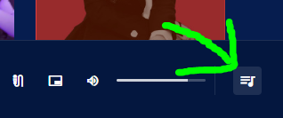
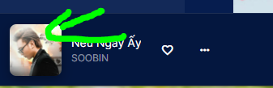
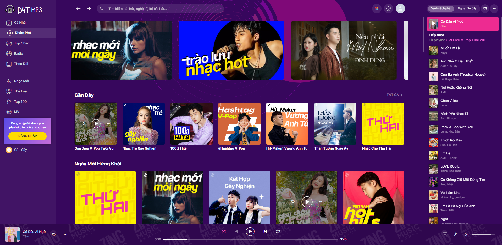
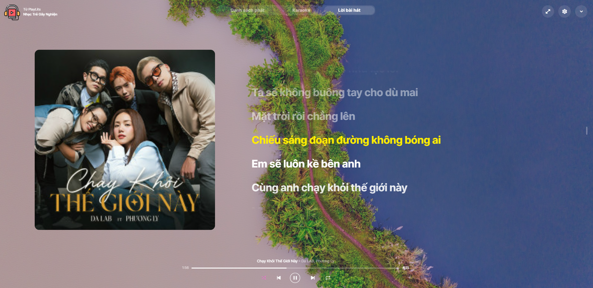
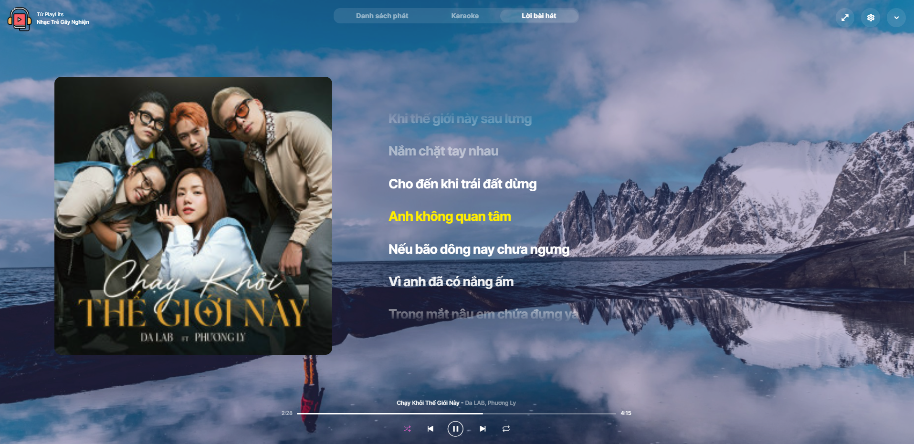
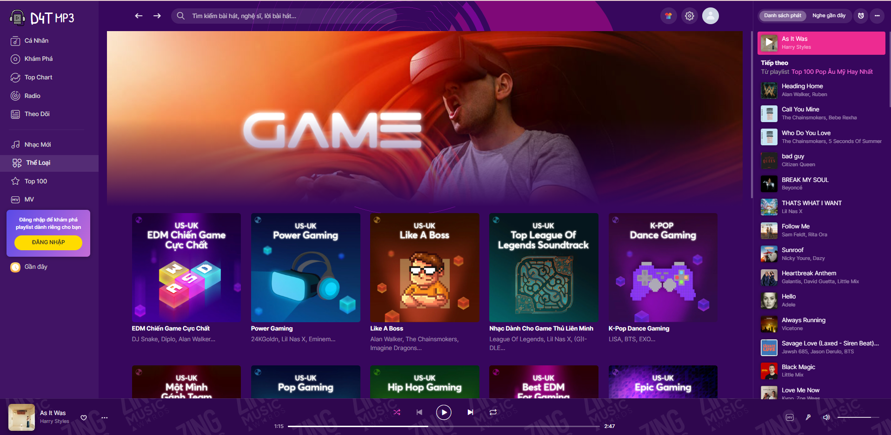
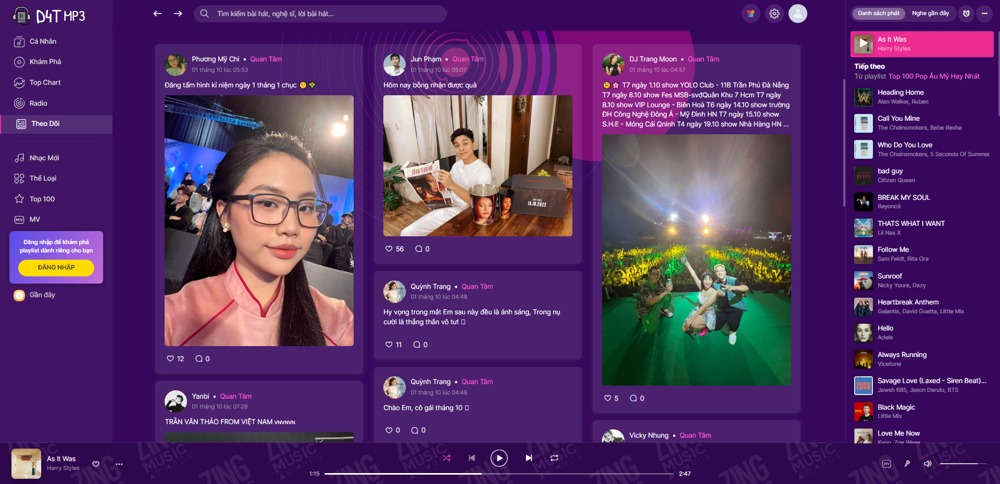
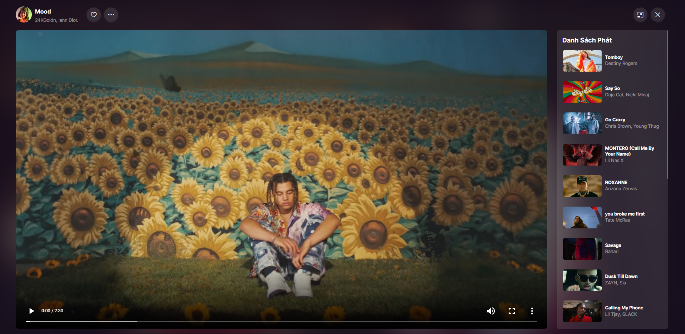
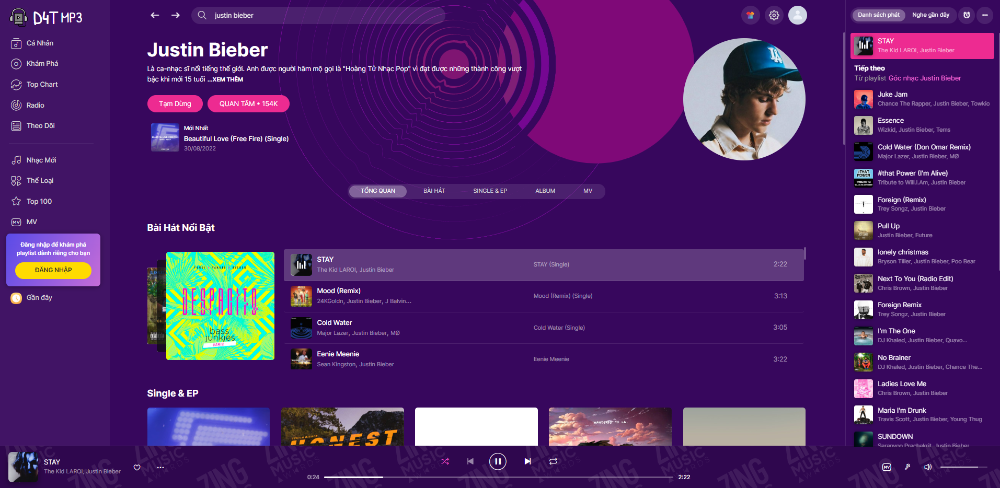

# Xin Chào, Tôi là Tiến Đạt 👋

## Chào Mừng tới dự án web nghe nhạc của tôi 👏

### Được sủ dụng những công nghệ 🧑‍🔧

**ChartJs**

 

---

 

## Giao Diện

-  Giao diện được lấy ý tưởng từ web Zingmp3
-  Đa số data được gọi từ Api
-  Nguồn tham khảo <https://www.npmjs.com/package/zingmp3-api-full>
-  Nguồn dữ liệu api được thu nhập trên các mxh:

   Song :
   <https://dathuynhmusictest.vercel.app/api/song?id=ZO98F9W6>

   Playlist :
   <https://dathuynhmusictest.vercel.app/api/playlist?id=ZWZB969E>

   Home :
   <https://dathuynhmusictest.vercel.app/api/home?page=1>

   Top 100 :
   <https://mp3.zing.vn/xhr/chart-realtime?songId=0&videoId=0&albumId=0&chart=song&time=-1>

   Lyric :
   <https://dathuynhmusictest.vercel.app/api/lyric?id=ZOACFBBU>

   List MV :
   <https://dathuynhmusictest.vercel.app/api/listMV?id=IWZ9Z08I&page=1&count=15>

 

---

 

## Chức Năng Chính 🦾

      -  Play / Pause
      -  Next / Prev
      -  Next bài ngẫu nhiên
      -  Lặp lại bài hát
      -  Thay đổi chủ đề
      -  Cài thời gian tắt nhạc
      -  Click thanh progress tua nhạc
      -  Click và kéo On / Off Volume
      -  Xem Lời Bản Nhạc, Active thời gian thực
      -  Trình phát nhạc tập trung (không gian fullscreen)
      -  Đăng nhâp , Đăng ký , Chỉnh sửa thông tin user
      -  Like list nhạc , bài hát , quan tâm nghệ sĩ
      -  Kéo thả thay đổi danh sách nhạc

 

---

## Hướng dẫn sử dụng

-  Nghe Nhạc:

   -  Click vào nút play khi hover vào 1 list nhạc sẽ xuất ra danh sách nhạc bên tab Danh sách phát (bên phải)

          

   -  Bài hát đầu tiên của list sẽ được play()
   -  Tại tab Danh sách phát bạn có thể hover vào item vào click btn Play để chay bản nhạc đó
   -  Đến trình phát nhạc tập trung hover vào ảnh thanh bottom và click

       

           

   -  Danh sách các phím tắt
      -  next: Mũi tên phải ->
      -  prev : Mũi tên trái <-
      -  pause / play : Space
      -  Bật / Tắt phát ngẫu nhiên : j
      -  Bật / Tắt lặp lại : l
   -  Lưu ý:
      -  Những bài có Vip sẽ ko lấy dữ liệu và phát nhạc được
      -  Karaoke đang hoàn tiện

 

---

## demo:

   
   
   
   
   
   
   
   
   

 

## Cảm ơn đã đọc. rất mong nhận được sự góp ý của bạn

### Liên hệ với tôi: **huynhtiiendat99@gmail.com**
